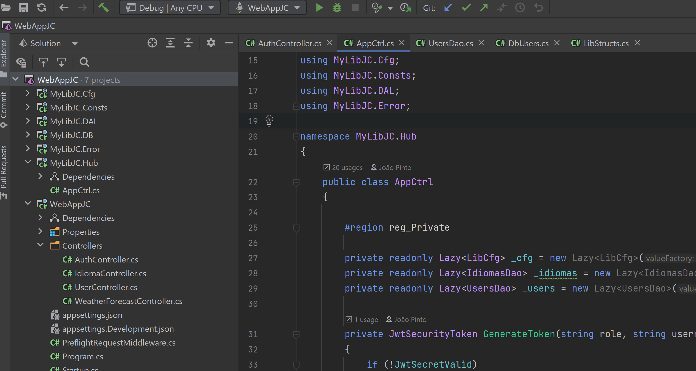

# web-api-testing-C#  
  
C# Web-API (prova de conceito)  
  
Este projeto C# é um template back-end para ser utilizado como ponto de partida para novos projetos (o objetivo deste exemplo é ter o controlo de toda a informação produzida e manipulada pelo API).  
  
## Composto por duas soluções:  
  
- WebAppJC (web API com swagger incluido para testar o acesso e funcionamento do API);    
- MyLibJC (diversas camadas de abstração para maior isolamento da informação, cada camada é um projeto):    
	- MyLibJC.Cfg (configurações);  
	- MyLibJC.Consts (constantes e estruturas);  
	- MyLibJC.DAL (DAL);  
	- MyLibJC.Error (Erros personalizados);  
	- MyLibJC.Hub (camada de acesso pelo API).  
  
## Funcionalidades implementadas:  
  
- JWT Token;  
- CORS;  
- Sessão (básico);  
- Nivel de acesso (básico).  
  
## NOTA:  
  
- Projeto ainda em desenvolvimento;  
- Os dados não são persistentes nesta versão;  
- Também está a ser utilizado para testar as funcionalidades do GitHub.  
    
## Sugestões?    
  
Tens alguma sugestão para este projeto?   
  